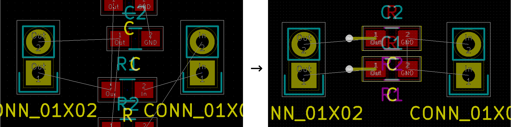

Adopt existing designs into a kicad_pcb to reuse pcb layouts for function groups or to have multiple instance of a group

You have the PCB design for a buck regulator and the surounding parts or some analog filter designed. Now you want to reuse it. Unfortunately kicad / pcbnew makes it borderline impossible to integrate / reuse PCB designs - there's no function to include a hierarchical PCB like there is for hierarchical sheets in eeeschema. adopt_subpcb.py to the rescue:

Example
===

```
  # cd test-rc; python3 ../adopt_subpcb.py \
    -o /tmp/test.kicad_pcb \
    test-rc/2x-rc.kicad_pcb \
    test-rc/rc.kicad_pcb \
    test-rc/2x-rc.net \
    0 0 0 -2.5
```
Howto structure your kicad project
===

sub(pcb,schematic) is the pcb-design and corresponding schematic you want to reuse

| Structure    | Example |     |
| ------------ | --------| --- |
| subschematic | rc.sch  |     |
| subpcb       | rc.kicad_pcb| pcb design created with the standard kicad workflow for the subpcb |
| mainschematic| 2x-rc.sch   | mainschematic includes subschematic as hierarchical sheet |
| - hierarchical sheets| - rc: rc.sch | instance 1: hierarchical sheet created with rc.sch as filename and rc as sheet name|
| - ...        | - rc2: rc.sch | instance 2 of same subschematic |
| netlist      | 2x-rc.net| netlist of the complete schematics |
| pcbdesign    | 2x-rc.kicad_pcb | the pcb design featuring subpcb |

before running `adopt_subpcb.py`, you have to open pcbnew for the pcbdesign and read the netlist, resulting in your design being populated with the parts. `child_module_ts` moves the parts and imports traces and vias from the subpcb, thereby adopting that design.

- You have to specify coordinates at which the origin of the subpcb is inserted into your pcb design.
- If your design features multiple instances of the same subpcb, all instances or the one you specify with --instance are adapted
